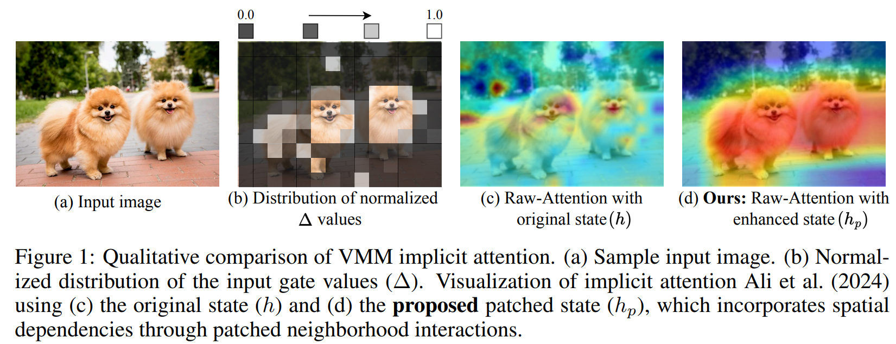

# Q2'25: Technology Update – Low Precision and Model Optimization
## Summary 
TBD
## Highlights
- **MMInference: Accelerating Pre-filling for Long-Context Visual Language Models via Modality-Aware Permutation Sparse Attention** ([https://arxiv.org/pdf/2502.02631](https://arxiv.org/pdf/2504.16083v1)).

The authors introduce MMInference (Multimodality Million tokens Inference), a **dynamic sparse attention method** that accelerates the prefilling stage for long-context multi-modal inputs. The core ideas stem
from analyzing the attention patterns specific to multi-modal inputs in VLMs: (1) Visual inputs exhibit strong temporal and spatial locality, leading to a unique sparse pattern the authors term the "Grid pattern".
(2) Attention patterns differ significantly within a modality versus across modalities. The authors introduces the permutation-based method for offline searching the optimal sparse patterns for each head based on the input and 
optimized kernels to compute attention much faster. MMInference speeds up the VLM pre-filling stage by up to **8.3x** (at 1 million tokens) **without losing accuracy** and **without needing any model retraining**.
The paper demonstrates maintained performance across various multi-modal benchmarks (like Video QA and Captioning) using state-of-the-art models (LongVila, LlavaVideo, VideoChat-Flash, Qwen2.5-VL).
The code is available at [https://aka.ms/MMInference](https://aka.ms/MMInference).

  

- **The Sparse Frontier: Sparse Attention Trade-offs in Transformer LLMs** ([https://arxiv.org/pdf/2504.17768](https://arxiv.org/pdf/2504.17768)).

The authors introduce SparseFrontier, a systematic evaluation of dynamic sparse attention methods aimed at accelerating inference in LLMs for long-context inputs (up to 128K tokens). The core ideas stem from an extensive analysis of sparse attention trade-offs across different inference stages, model scales, and task types: (1) Sparse attention during decoding tolerates higher sparsity than during prefilling, particularly in larger models, due to differences in memory and compute bottlenecks.
(2) No single sparse pattern is optimal across all tasks—retrieval, aggregation, and reasoning tasks each require different units of sparsification (e.g., blocks vs. tokens) and budget strategies.
During prefilling, the best sparsification structure (e.g., blocks or verticals and slashes) is task-dependent, with uniform allocation across layers performing comparably to dynamic allocation.
During decoding, page-level Quest excels by preserving the KV cache structure, avoiding the performance degradation associated with token pruning during generation.
Their isoFLOPS analysis shows that for long contexts, larger sparse models outperform smaller dense ones at the same compute cost. They also establish scaling laws predicting accuracy from model size, sequence length, and compression ratio.
The code is available at: [https://github.com/PiotrNawrot/sparse-frontier](https://github.com/PiotrNawrot/sparse-frontier).

- **XAttention: Block Sparse Attention with Antidiagonal Scoring** ([https://arxiv.org/pdf/2503.16428](https://arxiv.org/pdf/2503.16428)).

The authors introduce XAttention, a training-free block sparse attention method that accelerates the prefill stage of long-context Transformers using a novel antidiagonal scoring strategy. By summing attention values along antidiagonals, XAttention efficiently identifies important blocks while capturing key vertical and slash patterns.
It achieves up to 13.5× prefill speedup at 256K tokens, maintaining accuracy comparable to full attention across benchmarks in language (RULER, LongBench), video understanding (VideoMME), and video generation (VBench). A dynamic thresholding algorithm further improves accuracy-efficiency trade-offs per attention head. For video generation, a short full-attention warmup ensures layout fidelity.
The code is available at: [https://github.com/mit-han-lab/x-attention](https://github.com/mit-han-lab/x-attention).

  

- **OuroMamba: A Data-Free Quantization Framework for Vision Mamba Models** ([https://www.arxiv.org/pdf/2503.10959](https://www.arxiv.org/pdf/2503.10959)).
  *Intel and Georgia Tech*
  
The authors present OuroMamba, the first data-free post-training quantization (DFQ) method for vision Mamba-based models (VMMs). The authors identify two key challenges in enabling DFQ for VMMs, (1) VMM’s recurrent state transitions
restricts capturing of long-range interactions and leads to semantically weak synthetic data,(2) VMM activations exhibit dynamic outlier variations across time-steps, rendering existing static PTQ techniques ineffective.
To address these challenges,OuroMamba presents a two-stage framework: (1) OuroMamba-Gen to generate semantically rich and meaningful synthetic data. It applies contrastive learning on patch level VMM features generated
through neighborhood interactions in the latent state space, (2) OuroMamba-Quant to employ mixed-precision quantization with lightweight dynamic outlier detection during inference. In specific, the paper presents a thresholding
based outlier channel selection strategy for activations that gets updated every time-step. Extensive experiments across vision and generative tasks show that our data-free OuroMamba surpasses existing data-driven
PTQ techniques, achieving state-of-the-art performance across diverse quantization settings. Additionally, the authors demonstrate the efficacy via implementation of efficient GPU kernels to achieve practical latency speedup of up to 2.36×. 

 
- ...

## Papers with notable results 
### Quantization
- **SeedLM: Compressing LLM Weights into Seeds of Pseudo-Random Generators** ([https://arxiv.org/pdf/2410.10714](https://arxiv.org/pdf/2410.10714)).
  *Apple and Meta*

This paper introduces SeedLM, a novel data-free post-training compression method for Large Language Models (LLMs) that uses seeds of pseudo-random generators and some coefficients to recreate model weights. 
SeedLM aims to reduce memory access and leverage idle compute cycles during inference, effectively speeding up memory-bound tasks by trading compute for fewer memory accesses. 
The method generalizes well across diverse tasks, achieving better zero-shot accuracy retention at 4- and 3-bit compression compared to OmniQuant, AWQ and QuIP#. 
Additionally, FPGA-based tests demonstrate close to 4x speedup for memory-bound tasks such as generation for 4bit per value over an FP16 Llama baseline.

- ...
### Pruning / Sparsity
- TBD
- ...
### Other 
- **MoDM: Efficient Serving for Image Generation via Mixture-of-Diffusion Models** ([https://arxiv.org/pdf/2503.11972](https://arxiv.org/pdf/2503.11972)).
  *Intel and University of Michigan*
 
Diffusion-based text-to-image generation models trade latency for quality: small models are fast but generate lower quality images, while large models produce better images
but are slow. This paper presents MoDM, a novel caching-based serving system for diffusion models that dynamically balances latency and quality through a mixture of diffusion models.
Unlike prior approaches that rely on model-specific internal features, MoDM caches final images, allowing seamless retrieval and reuse across multiple diffusion model families.
This design enables adaptive serving by dynamically balancing latency and image quality: using smaller models for cache-hit requests to reduce latency while reserving larger
models for cache-miss requests to maintain quality. Small model image quality is preserved using retrieved cached images. MoDM has a global monitor that optimally allocates
GPU resources and balances inference workload, ensuring high throughput while meeting Service-Level Objectives (SLOs) under varying request rates. Extensive evaluations show
that MoDM significantly reduces an average serving time by 2.5× while retaining image quality, making it a practical solution for scalable and resource-efficient model deployment.
- ...
### Software
- TBD
- ...
