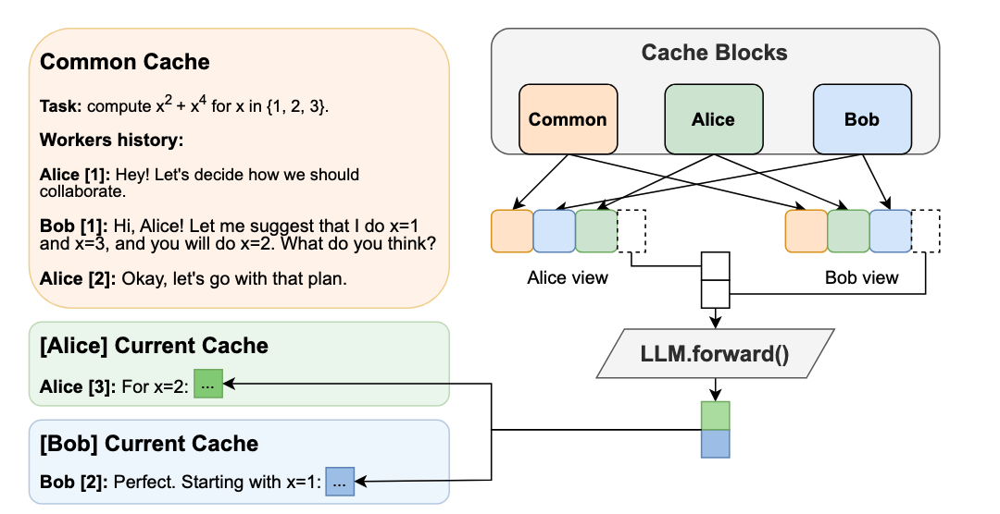
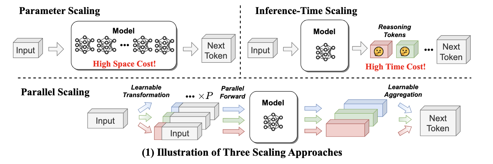
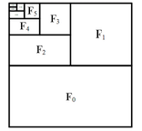

Q2'25: Technology Update – Low Precision and Model Optimization
## Summary 

This quarter marked a major shift towards efficiency in large-scale AI, driven by the unsustainable computational and memory costs of current architectures. The focus is now on making models dramatically faster and more hardware-friendly, especially for demanding long-context and multimodal tasks. 🚀 There is a growing adoption of dynamic, data-aware techniques like dynamic sparse attention and token pruning, which intelligently reduce computation by focusing only on the most critical information. Furthermore, optimization is increasingly tailored to new hardware through ultra-low precision; quantization is being pushed to the extreme, with native 1-bit (BitNet) inference and 4-bit (FP4) training becoming viable by aligning directly with new GPU capabilities. 

A parallel trend is the creation of simple, readable frameworks like Nano-vLLM, whose lightweight design aims to lower the barrier to entry for developers and researchers.

## Highlights
- **MMInference: Accelerating Pre-filling for Long-Context Visual Language Models via Modality-Aware Permutation Sparse Attention** ([https://arxiv.org/pdf/2502.02631](https://arxiv.org/pdf/2504.16083v1)).

The authors introduce MMInference (Multimodality Million tokens Inference), a **dynamic sparse attention method** that accelerates the prefilling stage for long-context multi-modal inputs. The core ideas stem
from analyzing the attention patterns specific to multi-modal inputs in VLMs: (1) Visual inputs exhibit strong temporal and spatial locality, leading to a unique sparse pattern the authors term the "Grid pattern".
(2) Attention patterns differ significantly within a modality versus across modalities. The authors introduces the permutation-based method for offline searching the optimal sparse patterns for each head based on the input and 
optimized kernels to compute attention much faster. MMInference speeds up the VLM pre-filling stage by up to **8.3x** (at 1 million tokens) **without losing accuracy** and **without needing any model retraining**.
The paper demonstrates maintained performance across various multi-modal benchmarks (like Video QA and Captioning) using state-of-the-art models (LongVila, LlavaVideo, VideoChat-Flash, Qwen2.5-VL).
The code is available at [https://aka.ms/MMInference](https://aka.ms/MMInference).

  

- **Beyond Text-Visual Attention: Exploiting Visual Cues for Effective Token Pruning in VLMs** ([https://arxiv.org/pdf/2412.01818](https://arxiv.org/pdf/2412.01818)).
*National Key Laboratory for Multimedia Information Processing, School of Computer Science, Peking University, ByteDance, Intel Labs China, CUHK MMLab*

The authors introduce VisPruner, a training-free method for compressing visual token sequences in VLMs, dramatically reducing computational overhead. Unlike prior approaches that rely on text-visual attention scores—often biased and dispersed—VisPruner leverages visual cues directly from the visual encoder.

They identify two key flaws in attention-based pruning:

* Attention shift: Positional bias causes attention to favor lower image regions (tokens closer to the text in sequence).

* Attention dispersion: Attention is spread too uniformly, making it hard to identify important tokens.

VisPruner first selects a small set of important tokens using [CLS] attention (typically focused on foreground objects), then complements them with diverse tokens selected via similarity-based filtering to preserve background and contextual information. This visual-centric pruning strategy avoids reliance on language model internals and is compatible with fast attention mechanisms like FlashAttention.

VisPruner outperforms finetuning-free baselines like FastV, SparseVLM, and VisionZip across 13 benchmarks—including high-resolution and video tasks—even when retaining as little as 5% of the original visual tokens. It achieves up to 95% FLOPs reduction and 75% latency reduction.

- **The Sparse Frontier: Sparse Attention Trade-offs in Transformer LLMs** ([https://arxiv.org/pdf/2504.17768](https://arxiv.org/pdf/2504.17768)).
*University of Edinburgh, Cohere, Meta*

The authors introduce SparseFrontier, a systematic evaluation of dynamic sparse attention methods aimed at accelerating inference in LLMs for long-context inputs (up to 128K tokens). The core ideas stem from an extensive analysis of sparse attention trade-offs across different inference stages, model scales, and task types: (1) Sparse attention during decoding tolerates higher sparsity than during prefilling, particularly in larger models, due to differences in memory and compute bottlenecks.
(2) No single sparse pattern is optimal across all tasks—retrieval, aggregation, and reasoning tasks each require different units of sparsification (e.g., blocks vs. tokens) and budget strategies.
During prefilling, the best sparsification structure (e.g., blocks or verticals and slashes) is task-dependent, with uniform allocation across layers performing comparably to dynamic allocation.
During decoding, page-level Quest excels by preserving the KV cache structure, avoiding the performance degradation associated with token pruning during generation.
Their isoFLOPS analysis shows that for long contexts, larger sparse models outperform smaller dense ones at the same compute cost. They also establish scaling laws predicting accuracy from model size, sequence length, and compression ratio.
The code is available at: [https://github.com/PiotrNawrot/sparse-frontier](https://github.com/PiotrNawrot/sparse-frontier).

- **OuroMamba: A Data-Free Quantization Framework for Vision Mamba Models** ([https://www.arxiv.org/pdf/2503.10959](https://www.arxiv.org/pdf/2503.10959)).
  *Intel and Georgia Tech*
  
The authors present OuroMamba, the first data-free post-training quantization (DFQ) method for vision Mamba-based models (VMMs). The authors identify two key challenges in enabling DFQ for VMMs, (1) VMM’s recurrent state transitions
restricts capturing of long-range interactions and leads to semantically weak synthetic data,(2) VMM activations exhibit dynamic outlier variations across time-steps, rendering existing static PTQ techniques ineffective.
To address these challenges,OuroMamba presents a two-stage framework: (1) OuroMamba-Gen to generate semantically rich and meaningful synthetic data. It applies contrastive learning on patch level VMM features generated
through neighborhood interactions in the latent state space, (2) OuroMamba-Quant to employ mixed-precision quantization with lightweight dynamic outlier detection during inference. In specific, the paper presents a thresholding
based outlier channel selection strategy for activations that gets updated every time-step. Extensive experiments across vision and generative tasks show that our data-free OuroMamba surpasses existing data-driven
PTQ techniques, achieving state-of-the-art performance across diverse quantization settings. Additionally, the authors demonstrate the efficacy via implementation of efficient GPU kernels to achieve practical latency speedup of up to 2.36×. 

 

- **TailorKV: A Hybrid Framework for Long-Context Inference via Tailored KV Cache Optimization** ([https://arxiv.org/pdf/2505.19586](https://arxiv.org/pdf/2505.19586)).
*Institute of Information Engineering and School of Cyber Security of University of Chinese Academy of Sciences, MiLM Plus, Xiaomi*

TailorKV is a novel framework designed to optimize the KV cache in LLMs for long-context inference, significantly reducing GPU memory usage and latency without sacrificing model performance. 
Instead of applying a one-size-fits-all compression strategy, TailorKV intelligently tailors compression based on the characteristics of each Transformer layer.

The authors look at how each layer distributes its attention across tokens:

* If a layer spreads attention broadly across many tokens, it’s considered to be dense. These layers are good candidates for quantization, because compressing them doesn’t significantly harm performance (usually shallow layers).

* If a layer focuses attention on just a few tokens, it’s considered to be sparse. These layers are better suited for sparse retrieval, where only the most important tokens are kept in memory (deeper layers).

To make this decision, they compute a score for each layer that reflects how concentrated or spread out the attention is. If the score is above a certain threshold, the layer is labeled quantization-friendly; otherwise, it’s considered sparsity-friendly. This classification is done offline, meaning it’s calculated once before inference, so it doesn’t affect runtime performance.
TailorKV drastically reduces memory usage by quantizing 1 to 2 layers to 1-bit precision and loading only 1% to 3% of the tokens for the remaining layers.
Maintains high accuracy across diverse tasks and datasets, outperforming state-of-the-art methods like SnapKV, Quest, and PQCache on LongBench. Code is available at: https://github.com/ydyhello/TailorKV.

 

- **Log-Linear Attention** ([https://arxiv.org/pdf/2506.04761](https://arxiv.org/pdf/2506.04761)).
*MIT, Princeton University, Together AI, Carnegie Mellon University, Mohamed bin Zayed University of AI, GenBio AI*

The authors present Log-Linear Attention, a general framework that extends linear attention and state-space models by introducing a logarithmically growing memory structure for efficient long-context modeling. The paper identifies two key limitations in prior linear attention architectures: (1) the use of fixed-size hidden states restricts their ability to model multi-scale temporal dependencies, and (2) their performance degrades on long sequences due to the lack of hierarchical context aggregation.
To address these challenges, Log-Linear Attention places a particular structure on the attention mask, enabling the compute cost to be log-linear and the memory cost to be logarithmic in sequence length (O(TlogT) training time, 
O(logT) inference time and memory). Conceptually, it uses a Fenwick tree–based scheme to hierarchically partition the input into power-of-two-sized segments. Each query attends to a logarithmic number of hidden states, summarizing increasingly coarse ranges of past tokens. This design emphasizes recent context with finer granularity, while efficiently compressing distant information.
The framework is instantiated on top of two representative models: Mamba-2 and Gated DeltaNet, resulting in Log-Linear Mamba-2 and Log-Linear Gated DeltaNet. These variants inherit the expressive recurrence structures of their linear counterparts but benefit from logarithmic memory growth and sub-quadratic training algorithms via a custom chunkwise parallel scan implementation in Triton.
Experiments across language modeling, long-context retrieval, and in-context reasoning benchmarks show that Log-Linear Attention consistently improves long-range recall while achieving competitive or better throughput than FlashAttention-2 at longer sequence lengths (>8K). The code is available at [https://github.com/HanGuo97/log-linear-attention](https://github.com/HanGuo97/log-linear-attention).

 

## Papers with notable results 
### Quantization
- **SeedLM: Compressing LLM Weights into Seeds of Pseudo-Random Generators** ([https://arxiv.org/pdf/2410.10714](https://arxiv.org/pdf/2410.10714)).
  *Apple and Meta*

This paper introduces SeedLM, a novel data-free post-training compression method for Large Language Models (LLMs) that uses seeds of pseudo-random generators and some coefficients to recreate model weights. 
SeedLM aims to reduce memory access and leverage idle compute cycles during inference, effectively speeding up memory-bound tasks by trading compute for fewer memory accesses. 
The method generalizes well across diverse tasks, achieving better zero-shot accuracy retention at 4- and 3-bit compression compared to OmniQuant, AWQ and QuIP#. 
Additionally, FPGA-based tests demonstrate close to 4x speedup for memory-bound tasks such as generation for 4bit per value over an FP16 Llama baseline.

- **MambaQuant: Quantizing the Mamba Family with Variance Aligned Rotation Methods** ([https://arxiv.org/abs/2501.13484](https://arxiv.org/abs/2501.13484)).
 *Houmo AI, Harbin Institute of Technology (Shenzhen), Nanjing University, Southeast University*

This paper tackles the challenge of post-training quantization for Mamba architectures. Standard quantization techniques adapted from large language models result in substantial accuracy loss when applied to Mamba models, largely due to extreme outliers and inconsistent variances across different channels in weights and activations. To address these issues, the authors propose MambaQuant, introducing two variance alignment techniques: KLT-Enhanced and Smooth-Fused rotations. These methods effectively equalize channel variances, resulting in more uniform data distributions before quantization. Experimental results show that MambaQuant enables Mamba models to be quantized to 8 bits for both weights and activations with less than 1% loss in accuracy, markedly surpassing previous approaches on both vision and language tasks. 

- **SageAttention3: Microscaling FP4 Attention for Inference and An Exploration of 8-bit Training** ([https://arxiv.org/abs/2505.11594](https://arxiv.org/abs/2505.11594)).
 *Tsinghua University*

The authors introduce SageAttention3, a novel FP4 micro-scaling quantization technique for Transformer attention designed to achieve a 5x speedup in inference on NVIDIA GPUs and an 8-bit novel training approach that preserves model accuracy during finetuning while reducing memory demands. The method applies FP4 quantization to the two main attention matrix multiplications, using a microscaling strategy with a group size of 16 elements per scale factor. This fine granularity limits the impact of outlier values that can otherwise cause significant quantization error. To address issues with quantizing the attention map, the authors propose a two-level quantization scheme. First, each row of attention map is scaled into the range 
[0, 448 × 6], which ensures the FP8 scaling factor (required by hardware) fully utilizes its representation range. Then, FP4 quantization is applied at the block level. This two-step process significantly reduces quantization error compared to direct quantization. Empirical results show that SageAttention3 delivers substantial inference speedups with minimal quality loss on language, image, and video generation benchmarks. The code is available at: https://github.com/thu-ml/SageAttention.

- **APHQ-ViT: Post-Training Quantization with Average Perturbation Hessian Based Reconstruction for Vision Transformers** ([https://arxiv.org/pdf/2504.02508](https://arxiv.org/pdf/2504.02508)).
  *Beihang University*

APHQ-ViT is a PTQ method designed to address the challenges of quantizing Vision Transformers, particularly under ultra-low bit settings. Traditional reconstruction-based PTQ methods, effective for Convolutional Neural Networks, often fail with ViTs due to inaccurate estimation of output importance and significant accuracy degradation when quantizing post-GELU activations.

To overcome these issues, APHQ-ViT introduces an improved Average Perturbation Hessian (APH) loss for better importance estimation. Additionally, it proposes an MLP Reconstruction technique that replaces the GELU activation function with ReLU in the MLP modules and reconstructs them using the APH loss on a small unlabeled calibration set. Experiments demonstrate that APHQ-ViT, utilizing linear quantizers, outperforms existing PTQ methods by substantial margins in 3-bit and 4-bit quantization across various vision tasks.

The source code for APHQ-ViT is available at https://github.com/GoatWu/APHQ-ViT.

- **LoTA-QAF: Lossless Ternary Adaptation for Quantization-Aware Fine-Tuning** ([https://arxiv.org/pdf/2505.18724](https://arxiv.org/pdf/2505.18724)).
 *Southwestern University of Finance and Economics, Financial Intelligence and Financial Engineering Key Laboratory of Sichuan Province,  The Hong Kong University of Science and Technology (Guangzhou), Sun Yat-sen University, Huawei Inc.*

LoTA-QAF is a quantization-aware fine-tuning method for LLMs designed for efficient edge deployment. Its key innovation is a ternary adaptation approach, where ternary adapter matrices can only increment, decrement, or leave unchanged each quantized integer weight (+1, −1, or 0) within the quantization grid during fine-tuning. This tightly restricts the amount each quantized value can change, ensuring the adapters do not make large modifications to weights. The method enables lossless merging of adaptation into the quantized model, preserving computational efficiency and model performance with no quantization-induced accuracy loss at merge. The method uses a novel ternary signed gradient descent (t-SignSGD) optimizer to efficiently update these highly constrained ternary weights. Evaluated on the Llama-3.1/3.3 and Qwen-2.5 families, LoTA-QAF consistently outperforms previous quantization-aware fine-tuning methods such as QA-LoRA, especially at very low bit-widths (2-bit and 3-bit quantization), recovering up to 5.14% more accuracy on MMLU compared to LoRA under 2-bit quantization, while also being 1.7x–2x faster at inference after merging. Task-specific fine-tuning shows LoTA-QAF improves on other quantization-aware methods, though it slightly lags behind full-precision LoRA in those scenarios.
The code is available at: https://github.com/KingdalfGoodman/LoTA-QAF.

- **DL-QAT: Weight-Decomposed Low-Rank Quantization-Aware Training for Large Language Models** ([https://arxiv.org/abs/2504.09223](https://arxiv.org/abs/2504.09223)).
  *AMD*

DL-QAT is a quantization-aware training (QAT) technique for LLMs that achieves high efficiency by updating less than 1% of parameters. It introduces group-specific quantization magnitudes and uses LoRA-based low-rank adaptation within the quantization space. Tested on LLaMA and LLaMA2, DL-QAT outperforms previous state-of-the-art methods—including QA-LoRA and LLM-QAT - by up to 4.2% on MMLU benchmarks for 3-bit models, while greatly reducing memory and training costs.

- **BitNet b1.58 2B4T Technical Report** ([https://arxiv.org/abs/2504.09223](https://arxiv.org/abs/2504.09223))
*Microsoft Research*

Microsoft Research released the weights for [BitNet b1.58 2B4T](https://huggingface.co/microsoft/bitnet-b1.58-2B-4T), the first open-source, native 1-bit Large Language Model (LLM) at the 2-billion parameter scale and inference framework [bitnet.cpp](https://github.com/microsoft/BitNet). The new 2B model demonstrates performance comparable to the Qwen 2.5 1.5B on benchmarks, while operating at 2x the speed and consuming 12x less energy.

- **Quartet: Native FP4 Training Can Be Optimal for Large Language Models** ([https://arxiv.org/pdf/2505.14669](https://arxiv.org/pdf/2505.14669)).
*ISTA, ETH Zürich*

Authors introduced a new method "Quarter" for the stable 4-bit floating-point (FP4) training. There is specifically designed for the native FP4 hardware in NVIDIA's new Blackwell GPUs and achieved a nearly 2x speedup on the most intensive training computations compared to 8-bit techniques, all while maintaining "near-lossless" accuracy. The method outlines to perform a forward pass that minimizes MSE (based on QuEST) together with a backward
pass that is unbiased (based on Stochastic Rounding). The code of extremely efficient GPU-aware implementation https://github.com/IST-DASLab/Quartet

- **InfiJanice: Joint Analysis and In-situ Correction Engine for Quantization-Induced Math Degradation in Large Language Models** ([https://arxiv.org/pdf/2505.11574](https://arxiv.org/pdf/2505.11574)).
*The Hong Kong Polytechnic University, Southern University of Science and Technology, Tsinghua University, Reallm Labs, Peking University, The Hong Kong University of Science and Technology, The University of Hong Kong*

Authours investigates how quantization significantly harms the mathematical reasoning abilities of LLMs. The study reveals that quantization can degrade reasoning accuracy by up to 69.81% on complex benchmarks, with smaller models being more severely affected. Authors developed an automated pipeline to analyze and categorize the specific errors introduced by quantization. Based on these findings, they created a compact, targeted dataset named "Silver Bullet." The most notable result is that fine-tuning a quantized model on as few as 332 of these curated examples for just 3–5 minutes on a single GPU is sufficient to restore its mathematical reasoning accuracy to the level of the original, full-precision model.

### Pruning / Sparsity
- **SparseVLM: Visual Token Sparsification for Efficient Vision-Language Model Inference** ([https://arxiv.org/pdf/2410.04417](https://arxiv.org/pdf/2410.04417)).

SparseVLM introduces a lightweight, training-free framework for visual token sparsification in vision-language models (VLMs). Unlike text-agnostic approaches, it leverages cross-attention to identify text-relevant visual tokens (“raters”) and adaptively prunes others based on the rank of the attention matrix. Crucially, SparseVLM doesn’t discard all pruned tokens—instead, it recycles the most informative ones (those with high attention relevance scores). These are grouped using a density peak clustering algorithm, and each cluster is compressed into a single representative token. The reconstructed tokens are then reinserted into the model, replacing the larger set of pruned tokens with a compact, information-rich representation. Applied to LLaVA, SparseVLM achieves a 4.5× compression rate with only a 0.9% accuracy drop, reduces CUDA latency by 37%, and saves 67% memory. The code is available at [https://github.com/Gumpest/SparseVLMs](https://github.com/Gumpest/SparseVLMs).

- **Token Sequence Compression for Efficient Multimodal Computing** ([https://arxiv.org/pdf/2504.17892](https://arxiv.org/pdf/2504.17892)).
*Stanford University*

The authors introduce a training-free method for compressing visual token sequences in visual language models (VLMs), significantly reducing computational costs. Instead of relying on attention-based “saliency”—a measure of how much attention a model gives to each token—they use simple clustering to group similar visual tokens and aggregate them. Their “Cluster & Aggregate” approach outperforms prior finetuning-free methods like VisionZip and SparseVLM across 8+ benchmarks, even when retaining as little as 11% of the original tokens. Surprisingly, random and spatial sampling also perform competitively, revealing high redundancy in visual encodings.

- **TopV: Compatible Token Pruning with Inference Time Optimization for Fast and Low-Memory Multimodal Vision Language Model** ([https://arxiv.org/pdf/2503.18278v2](https://arxiv.org/pdf/2503.18278v2)).

The authors introduce a training-free, optimization-based framework for reducing visual token redundancy in VLMs. Visual tokens often dominate the input sequence—up to 95% in some models. TopV addresses this by pruning unimportant visual tokens once during the prefilling stage, before decoding begins.
Instead of relying on attention scores, TopV estimates the importance of each visual token by solving an optimal transport problem. In this setup:

• Source tokens are the input visual tokens entering a specific transformer layer.

• Target tokens are the output visual tokens after that layer has processed the input—specifically, the output after the Post-LN sublayer.

TopV calculates how much each input token contributes to the output using the Sinkhorn algorithm, guided by a cost function that considers:

• How similar the tokens are in content (feature similarity),

• How close they are in the image (spatial proximity),

• How central they are in the image (centrality).

To prevent visual collapse—especially in detail-sensitive tasks like OCR and captioning—TopV includes a lightweight recovery step. From the discarded tokens, TopV uniformly samples a subset at regular intervals (e.g., every 4th or 6th token) and reinserts them into the token sequence alongside the top-k tokens, ensuring spatial diversity and semantic coverage without significant overhead. 
TopV performs pruning once after the prompt and image are processed. The pruned visual token set remains fixed throughout decoding, enabling efficient and consistent inference.

- **Beyond 2:4: exploring V:N:M sparsity for efficient transformer inference on GPUs**
([https://arxiv.org/abs/2410.16135](https://arxiv.org/abs/2410.16135)).
 *Tsinghua University, Beijing Jiaotong University*

This paper introduces and systematically studies V:N:M sparsity as a more efficient and flexible alternative to the industry-standard 2:4 sparsity for accelerating Transformer inference on GPUs. In the V:N:M approach, weight matrices are divided into V×M blocks; within each block, most columns are pruned, and 2:4 sparsity is then applied to the remaining columns. This scheme enables significantly higher and more adaptable sparsity ratios, while remaining compatible with existing GPU sparse tensor core acceleration. The authors propose a comprehensive framework for creating V:N:M-sparse Transformers: it features a heuristic method for selecting V and M values to optimize the accuracy-speedup trade-off, a V:N:M-specific channel permutation method for improving accuracy in low-budget training scenarios, and a three-stage LoRA training process for memory-efficient fine-tuning. Experimental results show that V:N:M-sparse Transformers can achieve much higher sparsity levels - such as 75% parameter reduction, while maintaining nearly lossless accuracy on downstream tasks, and outperform 2:4 sparsity in both speed and flexibility.

### Other 
- **MoDM: Efficient Serving for Image Generation via Mixture-of-Diffusion Models** ([https://arxiv.org/pdf/2503.11972](https://arxiv.org/pdf/2503.11972)).
  *Intel and University of Michigan*
 
Diffusion-based text-to-image generation models trade latency for quality: small models are fast but generate lower quality images, while large models produce better images
but are slow. This paper presents MoDM, a novel caching-based serving system for diffusion models that dynamically balances latency and quality through a mixture of diffusion models.
Unlike prior approaches that rely on model-specific internal features, MoDM caches final images, allowing seamless retrieval and reuse across multiple diffusion model families.
This design enables adaptive serving by dynamically balancing latency and image quality: using smaller models for cache-hit requests to reduce latency while reserving larger
models for cache-miss requests to maintain quality. Small model image quality is preserved using retrieved cached images. MoDM has a global monitor that optimally allocates
GPU resources and balances inference workload, ensuring high throughput while meeting Service-Level Objectives (SLOs) under varying request rates. Extensive evaluations show
that MoDM significantly reduces an average serving time by 2.5× while retaining image quality, making it a practical solution for scalable and resource-efficient model deployment.

- **Fast-dLLM: Training-free Acceleration of Diffusion LLM by Enabling KV Cache and Parallel Decoding** ([https://arxiv.org/abs/2505.22618](https://arxiv.org/abs/2505.22618)).
  *The University of Hong Kong, NVIDIA, MIT, Independent Researcher*

Fast-dLLM is a training-free method to accelerate diffusion-based large language models by introducing a block-wise KV Cache and confidence-aware parallel decoding. The block-wise KV Cache reuses more than 90% of attention activations with bidirectional (prefix and suffix) caching, delivering throughput improvements ranging from 8.1x to 27.6x while keeping accuracy loss under 2%. Confidence-aware parallel decoding selectively generates tokens that exceed a set confidence threshold (like 0.9), achieving up to 13.3x speedup and preserving output coherence thanks to theoretical guarantees. Experimentally, Fast-dLLM achieves up to 27.6× end-to-end speedup on 1024-token sequences (e.g., LLaDA, 8-shot) and keeps accuracy within 2% of the baseline across major reasoning and code benchmarks including GSM8K, MATH, HumanEval, and MBPP.
  
- **Hogwild! Inference: Parallel LLM Generation via Concurrent Attention** ([https://arxiv.org/pdf/2504.06261](https://arxiv.org/pdf/2504.06261)).
*Yandex, IST Austria, HSE University*

Hogwild! Inference iintroduces a novel paradigm for parallel inference for reasoning tasks that departs significantly from prior structured approaches by enabling dynamic, parallel collaboration. The method runs multiple LLM "workers" concurrently, allowing them to interact in real-time through a shared Key-Value (KV) cache. This shared workspace lets workers see each other's progress as it happens, fostering emergent teamwork without rigid, pre-planned coordination. 

A key innovation is the efficient use of Rotary Position Embeddings (RoPE) to synchronize the workers' views of the shared cache with minimal computational overhead. Empirical results show significant wall-clock **speedups—up to 3.6x with 4 workers—on** complex reasoning tasks. This is achieved "out of the box" on existing models without requiring fine-tuning and can be stacked with another optimization methods such as speculative decoding. The technique fundamentally improves the speed-cost-quality trade-off for inference, shifting the paradigm from sequential "chains of thought" to collaborative "teams of thought".
The code is available at https://github.com/eqimp/hogwild_llm.

 

- **Parallel Scaling Law for Language Models** ([https://arxiv.org/pdf/2505.10475](https://arxiv.org/pdf/2505.10475)).
*Zhejiang University, Qwen Team, Alibaba Group*

Authors introduce a novel "parallel" scaling method for LLMs (ParScale), distinct from traditional parameter (Dense, MoE) or inference-time (CoT) scaling. The technique processes a single input through 'P' parallel streams, each modified by a unique, learnable prefix vector. These streams are run concurrently on the same base model, and their outputs are intelligently aggregated by a small network. This method yields a quality improvement equivalent to increasing the model size by a factor of log(P), without actually expanding the core parameter count. For example, 8 parallel streams can match the performance of a model three times larger.

ParScale is highly efficient for local inference, where memory bandwidth is the main bottleneck. Compared to direct parameter scaling for similar quality, it can require up to 22x less additional RAM and add 6x less latency. The approach can be applied for pretrained models, even with frozen weight, fine-tune only perscale components. The code is available at https://github.com/QwenLM/ParScale.

 

- **Packing Input Frame Context in Next-Frame Prediction Models for Video Generation** ([https://arxiv.org/pdf/2504.12626](https://arxiv.org/pdf/2504.12626)).
*Stanford University*

FramePack is a framework for next-frame prediction video generators that enables **long-duration video synthesis with a constant computational cost (O(1))**, regardless of length. It circumvents growing context windows by maintaining a fixed-size token buffer and codes input frames as shown in the figure below.

To maintain temporal consistency and mitigate error accumulation, the system employs a bi-directional sampling scheme, alternating between forward and backward prediction passes. This efficiency allows a 13-billion parameter model to generate over 1800 frames (1 minute @ 30 fps) on a GPU with only 6GB of VRAM. The O(1) complexity in memory and latency makes FramePack a practical solution for generating minute-long videos on consumer hardware, with generation speeds of ~1.5 seconds per frame reported on an RTX 4090.
The code is available at https://github.com/lllyasviel/FramePack.

 

- **SANA-Sprint: One-Step Diffusion with Continuous-Time Consistency Distillation** ([https://arxiv.org/pdf/2503.09641](https://arxiv.org/pdf/2503.09641)).
*NVIDIA, MIT, Tsinghua University, Huggingface*

SANA-Sprint is a highly efficient text-to-image diffusion model designed for ultra-fast generation. Its core innovation is a hybrid distillation framework that combines continuous-time consistency models (sCM) with latent adversarial diffusion distillation (LADD). This approach drastically reduces inference requirements from over 20 steps to just 1-4.

Key performance benchmarks establish a new state-of-the-art. In a single step, SANA-Sprint generates a 1024x1024 image with FID of 7.59. This is achieved with a latency of just 0.1 seconds on an NVIDIA H100 GPU and 0.31 seconds on a consumer RTX 4090. This makes it approximately 10 times faster than its competitor, FLUX-schnell, while also delivering higher image quality.
The code is available at https://github.com/NVlabs/Sana.

### Software
- **FlashRNN: I/O-Aware Optimization of Traditional RNNs on modern hardware** ([https://arxiv.org/abs/2412.07752](https://arxiv.org/abs/2412.07752)).
  *Johannes Kepler University, NXAI Lab and NXAI GmbH*

FlashRNN extends traditional RNNs - such as LSTMs and GRUs - by introducing a parallelization scheme where the hidden state is divided into multiple smaller blocks, allowing for parallel computation similar to the head-wise processing in Transformers. The authors develop and open-source custom fused CUDA and Triton kernels that leverage the GPU memory hierarchy efficiently for both forward and backward passes, together with an automatic hardware-aware optimization framework. This approach achieves up to 50x speedup over vanilla PyTorch implementations, making RNNs competitive with Transformer-like models on modern GPUs. The code is available at: https://github.com/NX-AI/flashrnn.

- **Nano-vLLM** ([https://github.com/GeeeekExplorer/nano-vllm](https://github.com/GeeeekExplorer/nano-vllm))

A lightweight vLLM implementation built from scratch.
Key Features:
    - 🚀 Fast offline inference - Comparable inference speeds to vLLM
    - 📖 Readable codebase - **Clean implementation in ~ 1,200 lines** of Python code
    - ⚡ Optimization Suite - Prefix caching, Tensor Parallelism, Torch compilation, CUDA graph, etc.

- **NeMo-Inspector: A Visualization Tool for LLM Generation Analysis** ([https://arxiv.org/pdf/2505.00903](https://arxiv.org/pdf/2505.00903))
*Nvidia*

Authors introduce NeMo-Inspector, an open-source tool designed to simplify the analysis of synthetic datasets with integrated inference capabilities.

- **FlashInfer: Efficient and Customizable Attention Engine for LLM Inference Serving** ([https://arxiv.org/pdf/2501.01005](hhttps://arxiv.org/pdf/2501.01005))
*Nvidia*

Authors present FlashInfer: a customizable and efficient attention engine for LLM serving. FlashInfer tackles KV-cache storage heterogeneity
using block-sparse format and composable formats to optimize memory access and reduce redundancy, supports JIT compilation and load-balanced scheduling algorithm adjusts to dynamism of user requests while maintaining compatibility with CUDAGraph which requires static configuration. FlashInfer achieve
**29-69% inter-token-latency reduction** compared to Triton, **28-30% latency reduction for long-context inference**, and **13-17% speedup for LLM serving with parallel generation**.
The code is available at https://github.com/flashinfer-ai/flashinfer.
