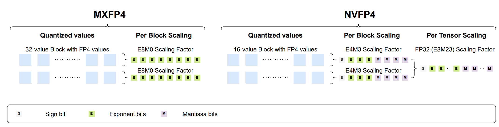
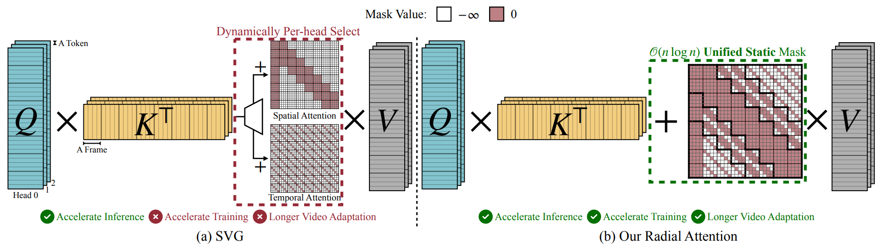
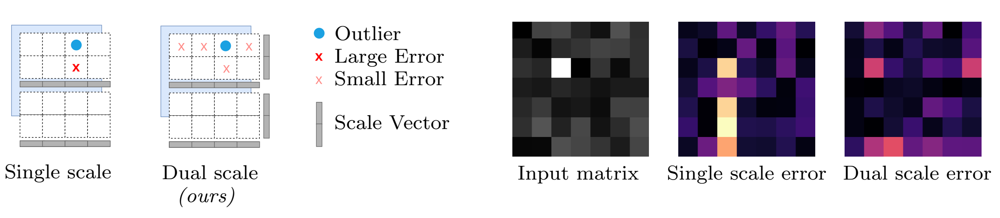
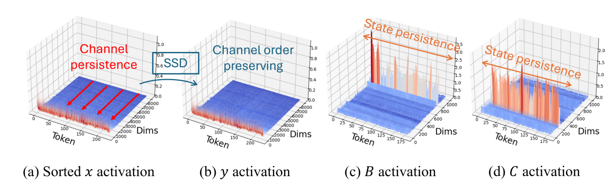
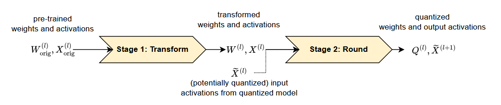
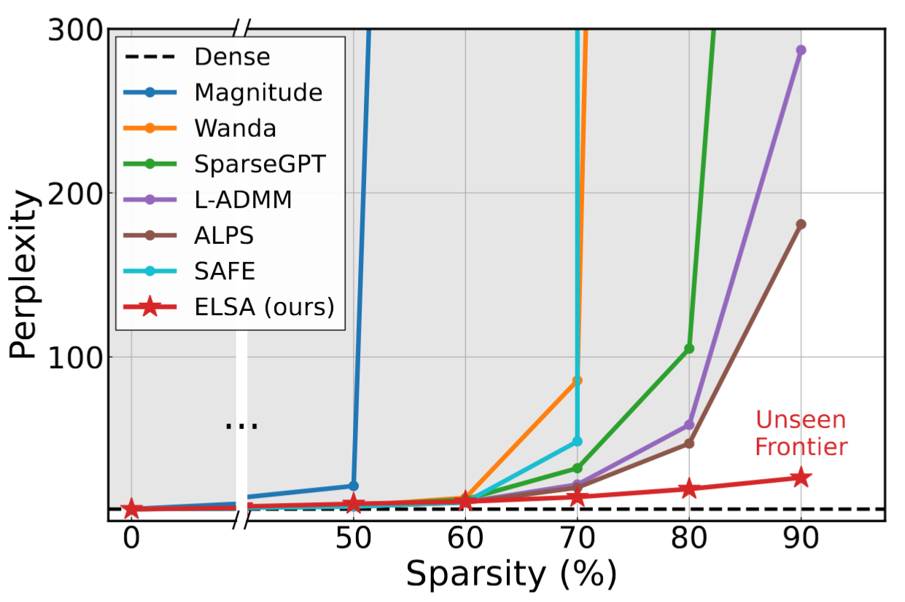

Q3'25: Technology Update – Low Precision and Model Optimization
## Summary

TBD

## Highlights

- **Bridging the Gap Between Promise and Performance for Microscaling FP4 Quantization** ([https://arxiv.org/pdf/2509.23202](https://arxiv.org/pdf/2509.23202)).
*ISTA, Red Hat AI, Yandex Research, ETH Zürich*

The authors provide a rigorous analysis of FP4 microscaling formats (MXFP4 and NVFP4) for LLM quantization, introduce Micro-Rotated-GPTQ (MR-GPTQ) and the QuTLASS GPU kernels to bridge the performance gap for such formats. The method uses MSE-optimized grids, static activation reordering, and fused online Hadamard rotations to recover 98-99% of FP16 accuracy while achieving up to 4x inference speedups on modern GPUs. Key insights from the analysis include:
    - The effectiveness of Hadamard transforms depends on the quantization group size; while they are beneficial for MXFP4 and INT4, they can actually degrade NVFP4 accuracy.
    - MR-GPTQ consistently improves the accuracy of the lower-performing MXFP4 format, bringing it within 1-2% of NVFP4's performance.
    - On average, NVFP4 and INT4 (with group size 32) offer similar quality.
    - MXFP4 kernels may achieve ~15% higher throughput than NVFP4 on B200 GPUs, likely due to simpler hardware implementation.

 

- **Radial Attention: O(n log n) Sparse Attention with Energy Decay for Long Video Generation** ([https://www.arxiv.org/pdf/2506.19852](https://www.arxiv.org/pdf/2506.19852)).
*MIT, NVIDIA, Princeton, UC Berkeley, Stanford, First Intelligence*

The paper "Radial Attention" introduces a sparse attention mechanism to optimize long video generation. Its core method reduces computational complexity from $O(n^2)$ to $O(n \log n)$ using a static mask inspired by "Spatiotemporal Energy Decay," where attention focuses on spatially and temporally closer tokens. This architecture is highly optimized for inference. It delivers up to a **3.7x speedup** on extended-length videos compared to standard dense attention, without any discernible loss in visual quality. For a concrete 500-frame, 720p video, the mechanism slashes the raw attention computation by a factor of 9x. The industrial impact is significant. Designed as a "plug-and-play" module, Radial Attention can be integrated into powerful pre-trained models like Wan2.1-14B and HunyuanVideo through efficient LoRA-based fine-tuning.

 

- **Expected Attention: KV Cache Compression by Estimating Attention from Future Queries Distribution** ([https://arxiv.org/pdf/2510.00636](https://arxiv.org/pdf/2510.00636)).
*Sapienza University of Rome, NVIDIA*

Expected Attention is a training-free KV cache compression method for LLMs that does not rely on observed attention scores, making it compatible with FlashAttention, where attention matrices are never materialized. It estimates the importance of cached key–value pairs by predicting how future queries will attend to them. Since hidden states before attention and MLP layers are empirically Gaussian-like, the method can analytically compute expected attention scores for each KV pair and rank them by importance for pruning. During decoding, Expected Attention maintains a small buffer of 128 hidden states to estimate future query statistics and performs compression every 512 generation steps. On LLaMA-3.1-8B, it achieves substantial memory savings—up to 15 GB reduction for 120k-token contexts. At a 50% compression ratio, Expected Attention maintains near-identical performance to the uncompressed baseline, effectively halving KV cache size while preserving output quality. Code: https://github.com/NVIDIA/kvpress

## Papers with notable results
### Quantization

- **SINQ: Sinkhorn-Normalized Quantization for Calibration-Free Low-Precision LLM Weights** ([https://arxiv.org/abs/2509.22944](https://arxiv.org/abs/2509.22944)).
*Huawei*
The authors introduce a novel data-free post-training quantization method - SINQ. Instead of the traditional single-scale approach, SINQ employs dual scales: one for rows and another for columns. The method adapts the Sinkhorn-Knopp algorithm to normalize the standard deviations of matrix rows and columns. The aglorithm is lightweight - operates at only 1.1x the runtime of basic RTN. The method proves robust across model scales, from small 0.6B parameter models to massive 235B parameter Mixture-of-Experts architectures. SINQ demonstrates orthogonality to other quantization advances. When combined with non-uniform quantization levels (NF4) or activation-aware calibration (A-SINQ with AWQ), it provides additional improvements.

 

- **70% Size, 100% Accuracy: Lossless LLM Compression for Efficient GPU Inference via Dynamic-Length Float** ([https://arxiv.org/pdf/2504.11651](https://arxiv.org/pdf/2504.11651)).
*Department of Computer Science, Rice University; Department of Computer and Data Sciences, Case Western Reserve University*

The paper presents DFloat11, a dynamic‐length float encoding scheme that exploits the low entropy of BFloat16 weights in large language models to achieve ~30% storage savings (reducing from 100% to ~70% size) without any loss in accuracy (bit‐for‐bit identical outputs). They do this by frequency‐based variable‐length coding of weight values, and couple it with a custom GPU decompression kernel allowing efficient inference. Experiments on large LLMs show major throughput gains and extended context length under fixed GPU memory budgets, making deployment more practical on resource‐constrained hardware.

- **XQUANT: Breaking the Memory Wall for LLM Inference with KV Cache Rematerialization** ([https://arxiv.org/pdf/2508.10395](https://arxiv.org/pdf/2508.10395)).
*UC Berkeley, FuriosaAI, ICSI, LBNL*

This paper introduces XQuant, a memory-efficient LLM inference method that quantizes and caches input activations (X) of each transformer layer instead of Key-Value pairs. During inference, K and V are rematerialized on-the-fly by multiplying the cached X with the projection matrices, halving the memory footprint compared to standard KV caching. XQuant uses uniform low-bit quantization for X, which is more robust to aggressive quantization than K/V, enabling high compression with minimal accuracy loss.
Building on this, XQuant‑CL exploits cross-layer similarity in X embeddings by compressing the differences between successive layers, which have a smaller dynamic range due to the transformer’s residual stream. Both XQuant and XQuant‑CL outperform state-of-the-art KV cache quantization methods like KVQuant, while retaining accuracy close to the FP16 baseline. For GQA models, X is down-projected via offline SVD into a smaller latent space, preserving memory efficiency and accuracy.
On LLaMA-2-7B and LLaMA-2-13B, XQuant achieves 7.7× memory savings with <0.1 perplexity degradation, while XQuant‑CL reaches 12.5× savings at 2-bit precision (0.1 perplexity degradation) and 10× savings at 3-bit precision (0.01 perplexity degradation).

- **Quantization Hurts Reasoning? An Empirical Study on Quantized Reasoning Models** ([https://papers-pdfs.assets.alphaxiv.org/2504.04823v2.pdf](https://papers-pdfs.assets.alphaxiv.org/2504.04823v2.pdf))
TODO: Nikolai Lialiushkin

- **Quamba2: A Robust and Scalable Post-training Quantization Framework for Selective State Space Models** ([https://papers-pdfs.assets.alphaxiv.org/2503.22879v3.pdf](https://papers-pdfs.assets.alphaxiv.org/2503.22879v3.pdf)).
*The University of Texas at Austin, Cornell University, National Yang Ming Chiao Tung University*

State Space Models (SSMs) are highly sensitive to quantization due to their linear recurrence process, which magnifies even minor numerical perturbations, making traditional Transformer quantization methods ineffective. The authors identify several distinctive properties of SSMs: (1) the input and output channel orders remain consistent, and (2) the activated channels and states are stable across time steps and input variations. Leveraging these insights, they propose Quamba2, a post-training quantization framework specifically tailored for SSMs. Quamba2 utilizes these properties through three key strategies: an offline sort-and-cluster process for input quantization, per-state-group quantization for input-dependent parameters, and cluster-aware weight reordering. The approach supports multiple precision configurations—W8A8, W4A8, and W4A16—across both Mamba1 and Mamba2 architectures.
Empirical results show that Quamba2 surpasses existing SSM quantization methods on zero-shot and MMLU benchmarks. It achieves up to 1.3× faster pre-filling, 3× faster generation, and 4× lower memory usage on models such as Mamba2-8B, with only a 1.6% average accuracy drop. Code is available at https://github.com/enyac-group/Quamba.

 

- **Qronos: Correcting the Past by Shaping the Future... in Post-Training Quantization** ([https://papers-pdfs.assets.alphaxiv.org/2505.11695v2.pdf](https://papers-pdfs.assets.alphaxiv.org/2505.11695v2.pdf))
*Department of Mathematics University of California, San Diego, AMD*

 

### Pruning / Sparsity
- **PagedEviction: Structured Block-wise KV Cache Pruning for Efficient Large Language Model Inference** ([https://arxiv.org/pdf/2509.04377](https://arxiv.org/pdf/2509.04377)).
*Argonne National Laboratory, Illinois Institute of Technology*

The authors propose PagedEviction, a structured block-wise KV cache eviction strategy designed for vLLM’s PagedAttention to enhance memory efficiency during large language model inference. The method computes token importance using the ratio of the L2 norm of Value to Key tokens, avoiding the need to store attention weights for compatibility with FlashAttention. It evicts an entire block only when the current block becomes full, reducing fragmentation and minimizing per-step eviction overhead. PagedEviction achieves high compression efficiency with minimal accuracy loss, significantly outperforming prior methods on long-context tasks. For example, it improves ROUGE scores by 15–20% over StreamingLLM and KeyDiff at tight cache budgets while closely matching full-cache performance at larger budgets across LLaMA-3.2-1B-Instruct and 3B-Instruct models.

- **REAP: One-Shot Pruning for Trillion-Parameter Mixture-of-Experts Models** ([https://www.cerebras.ai/blog/reap](https://www.cerebras.ai/blog/reap)).
*Cerebras Systems*
TODO: Nikolai Lialiushkin

- **The Unseen Frontier: Pushing the Limits of LLM Sparsity with Surrogate-Free ADMM** ([https://papers-pdfs.assets.alphaxiv.org/2510.01650v1.pdf](https://papers-pdfs.assets.alphaxiv.org/2510.01650v1.pdf))
*POSTECH, ISTA*

This paper tackles the limitation of existing pruning methods for large language models, which struggle to exceed 50–60% sparsity without severe performance loss. The authors attribute this to the use of indirect objectives, such as minimizing layer-wise reconstruction errors, which accumulate mistakes and lead to suboptimal outcomes. To address this, the proposed method, ELSA, directly optimizes the true task objective — minimizing loss on actual downstream tasks — rather than relying on surrogate goals. It leverages the ADMM framework, a proven mathematical technique that decomposes complex problems into simpler alternating steps, to guide the pruning process while maintaining alignment with the model’s real objectives. A lightweight variant, ELSA-L, further improves scalability by using lower-precision data formats, enabling efficient pruning of even larger models. ELSA achieves 7.8× lower perplexity than the best existing method on LLaMA-2-7B at 90% sparsity. Although some accuracy loss remains, this represents a major breakthrough, and the authors argue that improved global optimization, like their approach, could further narrow this gap. The code is available at: https://github.com/IST-DASLab/FP-Quant.

 

### Other
- **Stop Spinning Wheels: Mitigating LLM Overthinking via Mining Patterns for Early Reasoning Exit** ([https://arxiv.org/pdf/2508.17627](https://arxiv.org/pdf/2508.17627))
*Institute of Computing Technology, University of Chinese Academy of Sciences, Meituan - Beijing, China*

The authors introduce a lightweight framework to detect and terminate reasoning at the optimal Reasoning Completion Point (RCP), preventing unnecessary token generation in large reasoning models. They categorize the reasoning process of LLMs into three stages: insufficient exploration, compensatory reasoning, and reasoning convergence. Typically, LLMs produce correct answers during the compensatory reasoning stage, while the reasoning convergence stage often triggers overthinking, leading to excessive resource usage or even infinite loops. The RCP is defined as the boundary marking the end of the compensatory reasoning stage and typically appears at the end of the first complete reasoning cycle, beyond which additional reasoning offers no accuracy gain. To balance efficiency and accuracy, the authors distilled insights from CatBoost feature importance analysis into a concise and effective set of stepwise heuristic rules. Experiments on benchmarks such as AIME24, AIME25, and GPQA-D demonstrate that the proposed strategy reduces token consumption by over 30% while maintaining or improving reasoning accuracy.

 

### Software
- ...
