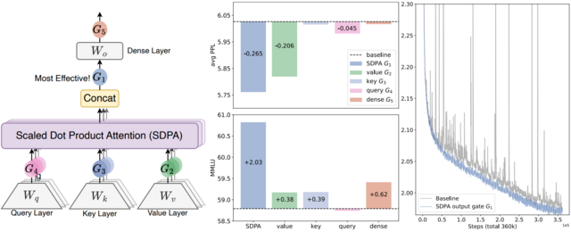
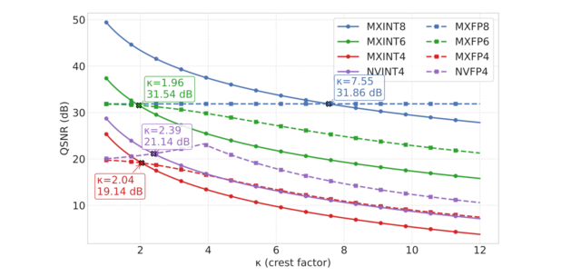
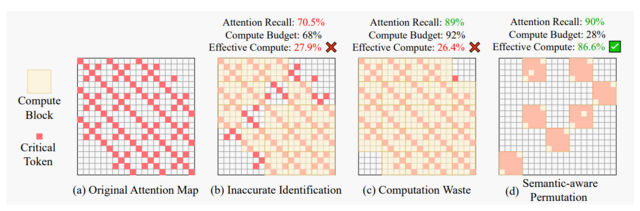
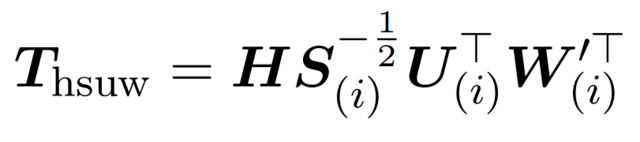
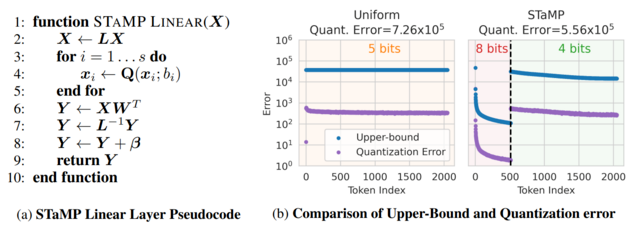
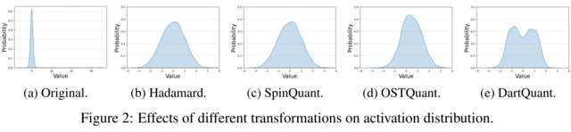
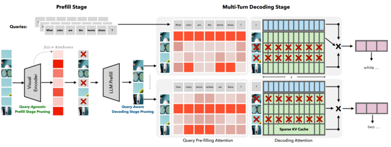
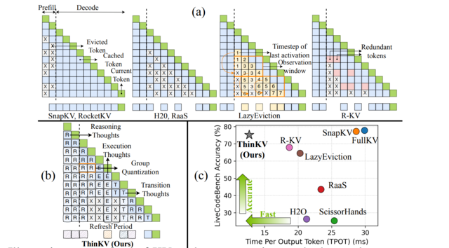
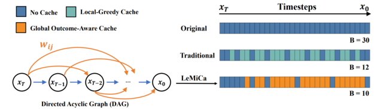
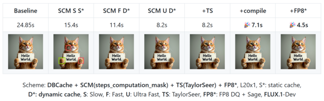

Q4'25: Technology Update – Low Precision and Model Optimization
## Summary

This quarter's research reveals several converging trends in efficient AI:
1. Hadamard and learned rotations are now standard in quantization pipelines. The focus has shifted from whether to use rotations to how to compute them efficiently—via QR decomposition or per-block optimal transforms. New evidence shows integer formats (MXINT8, NVINT4) can outperform floating-point alternatives when combined with rotation-based outlier suppression.
2. Diffusion-based video generation benefits from intelligent caching strategies with global outcome-aware metrics and principled optimization, replacing prior greedy approaches.
3. LLM-based agents now achieve 100% correctness on KernelBench - GPU kernel benchmark.

## Highlights

- **Gated Attention for Large Language Models: Non-linearity, Sparsity, and Attention-Sink-Free** (https://arxiv.org/pdf/2505.06708). The authors introduce Gated Attention, a simple architectural refinement that inserts a learnable, input-dependent sigmoid gate directly after the output of Scaled Dot-Product Attention, introducing query-dependent sparsity and crucial non-linearity between the value and final output projections. This minimal change suppresses redundant attention contributions, eliminates training instabilities like loss spikes, and consistently improves perplexity and downstream performance across both 15B MoE and 1.7B dense models trained on massive datasets. Notably, it directly addresses the root causes of the attention sink and massive activations through learned, input-sensitive sparsity—eliminating the need for manual workarounds like special sink tokens or ad hoc normalization tricks. As a result, the model exhibits far better long-context extrapolation, maintaining performance even when context lengths are extended beyond the training range. The reduction in extreme activation values and the elimination of disproportionate attention to early tokens suggest that this approach will make models more amenable to compression techniques such as quantization and token pruning, by creating a more uniform, sparse, and predictable activation profile. The code: https://github.com/qiuzh20/gated_attention

 

- **INT v.s. FP: A Comprehensive Study of Fine-Grained Low-bit Quantization Formats** (https://arxiv.org/abs/2510.25602). A comprehensive study on fine-grained, low-bit quantization formats challenges the current industry shift toward floating-point (FP) formats. The authors provide an in-depth analysis of quantization error using both theoretical Gaussian data and experimental training tensors, revealing a critical crossover point: floating-point formats are preferable for handling the high crest factors typical of coarse-grained quantization, whereas integer formats excel when crest factors are low, a condition common in fine-grained, block-wise quantization. Validating this insight across 12 diverse LLMs for direct-cast inference, the experiments consistently conclude that MXINT8 is superior to MXFP8 in accuracy and that NVINT4 can surpass NVFP4 when paired with outlier suppression techniques like Hadamard rotation. Furthermore, training experiments conducted with 1B and 3B Llama-3-style models demonstrate the superiority of MXINT8 over MXFP8, achieving nearly the same average accuracy across six common-sense reasoning tasks as standard BF16 training. The code: https://github.com/ChenMnZ/INT_vs_FP

 

- **Sparse VideoGen2: Accelerate Video Generation with Sparse Attention via Semantic-Aware Permutation** (https://arxiv.org/pdf/2505.18875). SVG2 is a training-free sparse attention method designed to accelerate video generation in DiT-based models. Its core idea is to use semantic-aware permutation to better identify critical tokens and reduce unnecessary sparse-attention overhead. The method introduces three key techniques:
  - Semantic-aware permutation: k-means clustering is applied to the Q/K/V vectors of each head and layer, and tokens are permuted by cluster to form semantically coherent blocks, improving the accuracy of critical-token detection.
  - Dynamic top-p critical-token selection: Cluster centroids approximate attention scores, and clusters (and their tokens) are selected until the cumulative probability reaches p, enabling dynamic compute budgeting.
  - Customized sparse-attention kernels: Since semantic-aware clusters vary naturally in size, custom kernels are used to support dynamic block sizes, which fixed-size sparse kernels cannot handle efficiently.

  This approach achieves up to 2.30× and 1.89× speedups while maintaining PSNRs of 30 and 26 on HunyuanVideo and Wan 2.1, respectively. The code: https://github.com/svg-project/Sparse-VideoGen

 

## Papers with notable results
### Quantization
- **WUSH: Near-Optimal Adaptive Transforms for LLM Quantization** (https://arxiv.org/pdf/2512.00956). This work introduces WUSH, a method that derives optimal blockwise transforms for joint weight-activation quantization in large language models. WUSH consistently reduces quantization loss and improves LLM accuracy across MXFP4 and NVFP4 formats compared to the Hadamard transform across various LLM architectures (e.g., Llama-3.2-3B, Qwen3-14B). This comes at the cost of increased inference overhead, since WUSH computes a unique, data-dependent transform for each block, rather than reusing a single fixed Hadamard transform across all blocks.

 

- **STaMP: Sequence Transformation and Mixed Precision for Low-Precision Activation Quantization** (https://arxiv.org/abs/2510.26771). STaMP is a post-training quantization technique designed to enhance the accuracy of low-bit activation quantization in large generative models by exploiting correlations along the sequence dimension rather than just the feature dimension. It combines invertible linear transformations—such as the Discrete Wavelet Transform (DWT) or Discrete Cosine Transform (DCT)—with mixed-precision quantization to concentrate the majority of activation energy into a small subset of tokens. These high-energy tokens are preserved at higher bit depths (e.g., 8-bit), while the remaining tokens are quantized to lower precision (e.g., 4-bit). The approach reduces quantization error more effectively than uniform bit allocation, especially under aggressive 4-bit constraints, and works synergistically with existing methods like SmoothQuant or QuaRot that operate on feature axes. Crucially, because the sequence transformation is orthogonal and linear, its inverse can often be merged with downstream operations such as bias addition or matrix multiplication, resulting in negligible additional computational cost during inference. The method requires no retraining and has been shown to improve both language and vision models consistently across benchmarks.

 

- **KVLinC: KV CACHE QUANTIZATION WITH HADAMARD ROTATION AND LINEAR CORRECTION** (https://arxiv.org/pdf/2510.05373v1). KVLinC is a framework designed to mitigate attention errors arising from KV cache quantization. The authors integrate two complementary techniques to enable robust low-precision caching. First, through a detailed analysis of Hadamard rotation-based quantization strategies, they show that applying channel-wise quantization to raw keys and token-wise quantization to Hadamard-transformed values minimizes quantization error. Second, to address residual errors from quantized keys, they propose lightweight linear correction adapters that explicitly learn to compensate for distortions in attention. Extensive evaluation across the Llama, Qwen2.5, and Qwen3 model families demonstrates that KVLinC consistently matches or surpasses strong baselines under aggressive KV-cache compression. Finally, the authors develop a custom attention kernel that delivers up to 2.55× speedup over FlashAttention, enabling scalable, efficient, and long-context LLM inference.

- **DartQuant: Efficient Rotational Distribution Calibration for LLM Quantization** (https://arxiv.org/pdf/2511.04063). DartQuant introduces an efficient method for quantizing large language models (LLMs). Instead of relying on computationally expensive end-to-end fine-tuning of rotation matrices—as done in methods like SpinQuant and OSTQuant—DartQuant eliminates the need for task-specific losses and instead optimizes activation distributions to be more uniform, using a novel loss function called Whip loss. This approach reduces the impact of extreme outliers in activations, which are a major source of quantization error, by reshaping the distribution from a Laplacian-like form toward a uniform one within a bounded range. To further reduce overhead, DartQuant proposes QR-Orth, an optimization scheme that leverages QR decomposition to enforce orthogonality on rotation matrices without requiring complex manifold optimizers like Cayley SGD. This cuts the computational cost of rotation calibration by 47× and memory usage by 10× on a 70B model, enabling full rotational calibration on a single consumer-grade RTX 3090 GPU in under 3 hours. The method maintains or slightly improves upon state-of-the-art quantization accuracy across multiple LLMs (Llama-2, Llama-3, Mixtral, DeepSeek-MoE) and evaluation benchmarks, including zero-shot reasoning tasks and perplexity metrics, while being robust to different calibration datasets and sample sizes. The code: https://github.com/CAS-CLab/DartQuant

 

### Pruning / Sparsity
- **SparseVILA: Decoupling Visual Sparsity for Efficient VLM Inference** (https://arxiv.org/pdf/2510.17777). SparseVILA addresses the scalability limitations of Vision Language Models (VLMs) caused by the high computational cost of processing extensive visual tokens in long-context tasks. The framework introduces a decoupled sparsity paradigm that applies distinct optimization strategies to the prefill and decoding stages of inference. During the prefill phase, the model employs query-agnostic pruning to remove redundant visual data based on salience, efficiently creating a compact shared context. In contrast, the decoding phase utilizes query-aware retrieval to dynamically select only the specific visual tokens relevant to the current text query from the cache. This design preserves the integrity of multi-turn conversations by retaining a comprehensive visual cache, allowing different tokens to be retrieved for subsequent questions without permanent information loss. Experimental results demonstrate that SparseVILA achieves up to 2.6x end-to-end speedups on long-context video tasks while maintaining or improving accuracy across various image and reasoning benchmarks.

 

- **THINKV: THOUGHT-ADAPTIVE KV CACHE COMPRESSION FOR EFFICIENT REASONING MODELS** (https://arxiv.org/pdf/2510.01290v1).
ThinKV is a KV cache compression framework for LRMs on tasks like coding and mathematics. It classifies CoT tokens into Reasoning (R), Execution (E), and Transition (T) based on attention sparsity (T > R > E) using an offline calibration phase with Kernel Density Estimation to determine sparsity thresholds. The framework employs two main strategies:

  * Think Before You Quantize: assigns token precision by importance. R/E tokens use 4-bit NVFP4, T tokens use 2-bit ternary, with group quantization (g=16) and shared FP8 (E4M3) scales; keys are quantized per-channel, values per-token. Outlier Transition thoughts are recognized as vital for backtracking and preventing model loops. Token importance is measured via KL divergence of the final answer distribution when a thought segment is removed.
  * Think Before You Evict: a thought-adaptive eviction scheme aligned with PagedAttention. K-means clustering on post-RoPE key embeddings retains cluster centroids and corresponding values for evicted segments.

  Experimental results show near-lossless accuracy and up to a 5.8× improvement in inference throughput, while utilizing less than 5% of the original KV cache memory. It operates at an average precision of 3.4–3.8 bits.

 

### Caching
- **LeMiCa: Lexicographic Minimax Path Caching for Efficient Diffusion-Based Video Generation** (https://arxiv.org/pdf/2511.00090)
LeMiCa is a novel, training-free, and efficient acceleration framework for diffusion-based video generation. The key idea is to take a global view of caching error using a Global Outcome-Aware error metric, which measures the impact of each cache segment on the final output. This approach removes temporal heterogeneity and mitigates error propagation. Using this metric, LeMiCa builds a Directed Acyclic Graph (DAG) in which each edge represents a potential cache segment, weighted by its global impact on output quality. The DAG is generated offline using multiple prompts and full sampling trajectories. LeMiCa then applies lexicographic minimax optimization to choose the path that minimizes worst-case degradation. Among all feasible paths under a fixed computational budget, it selects the one with the smallest maximum error.
LeMiCa-slow achieves the highest reconstruction quality, reducing LPIPS from 0.134 → 0.05 on Open-Sora and 0.195 → 0.091 on Latte—over 2× improvement compared to TeaCache-slow. LeMiCa-fast improves inference speed from 2.60× → 2.93× on Latte relative to TeaCache-fast, while preserving visual quality. Unlike prior work that relies on online greedy strategies, LeMiCa precomputes its caching policy, eliminating runtime overhead.
Code: https://unicomai.github.io/LeMiCa.

 

- **CacheDiT: A PyTorch-native and Flexible Inference Engine with Hybrid Cache Acceleration and Parallelism for 🤗 DiTs** (https://github.com/vipshop/cache-dit). It provides a unified cache API that supports features like automatic block adapters, DBCache, and more, covering almost all Diffusers' DiT-based pipelines. DBCache is a training-free Dual Block Caching mechanism inspired by the U-Net architecture. It splits the DiT Transformer block stack into three functional segments:
  - Probe (front): performs full computation to capture residual signals and compare them with the previous step.
  - Cache (middle): skips computation and reuses cached outputs when residual changes stay below a configurable threshold.
  - Corrector (rear): always recomputes to refine outputs and correct any accumulated deviations. This probe → decision → correction loop enables structured, reliable caching that can be applied across DiT models without any retraining.

 

### Inference
- [vLLM-Gaudi](https://github.com/vllm-project/vllm-gaudi/releases/tag/v0.11.2) - first production-ready vLLM plugin for Gaudi, developed in close collaboration with the Intel team and fully aligned with upstream vLLM.

### Compilation
- **KernelFalcon: Autonomous GPU Kernel Generation via Deep Agents** (https://pytorch.org/blog/kernelfalcon-autonomous-gpu-kernel-generation-via-deep-agents/) - a deep agent architecture for generating GPU kernels that combines hierarchical task decomposition and delegation, a deterministic control plane with early-win parallel search, grounded tool use, and persistent memory/observability. KernelFalcon is the first known open agentic system to achieve 100% correctness across all 250 L1/L2/L3 KernelBench tasks.
